# SKYNovel Extension for VSCode

> [SKYNovel - Visual Studio Marketplace](https://marketplace.visualstudio.com/items?itemName=famibee2.skynovel2)
> 
> 2022/11/25 リンク変更(link change) famibee2.skynovel2

[CHANGELOG.md](CHANGELOG.md)

---
## After installing this extension ... / この拡張機能をインストールしたら……。
 Next, let's download and unzip the sample project, and open the folder with VSCode!

　次はサンプルプロジェクトをダウンロード・解凍し、VSCodeで【フォルダを開く】してみましょう！
- [Novelgame(Yoko-gaki) sample project「初音館にて」](https://github.com/famibee/SKYNovel_hatsune)
- [Novelgame(Tate-gaki) sample project「桜の樹の下には」](https://github.com/famibee/SKYNovel_uc)
- [simple sample project](https://github.com/famibee/SKYNovel_sample)

# List of Functions / 機能一覧
- [Activity Bar / アクティビティバー](#activity-bar--アクティビティバー)
- [Startup timing / 起動タイミング](#startup-timing--起動タイミング)

- [Syntax Highlight / シンタックスハイライト](#syntax-Highlight--シンタックスハイライト)
- [Diagnostic function](#diagnostic-function) / [診断機能](#診断機能)
- [Coding assistance](#coding-assistance) / [コーディング補助](#コーディング補助)
- [Outline view and symbol search](#outline-view-and-symbol-search) / [アウトライン表示とシンボル検索](#アウトライン表示とシンボル検索)
- [Reference search palette / リファレンス検索パレット](#Reference-search-palette--リファレンス検索パレット)
- [Overview of Macros, Declaration of Types of Arguments](#overview-of-macros-declaration-of-types-of-arguments) / [マクロの概要説明と引数の型宣言](#マクロの概要説明と引数の型宣言)

- [Debugger](#Debugger) / [デバッガー](#デバッガー)
- [shortcut key / ショートカットキー](#shortcut-key--ショートカットキー)

- [Font size optimization / フォントサイズ最適化](#font-size-optimization--フォントサイズ最適化)
- [Automatic icon creation / アイコン自動作成](#automatic-icon-creation--アイコン自動作成)

---
## Activity Bar / アクティビティバー
- Add Activity Bar to provide various information and useful functions.
	- Activity Barを追加し、各種情報や便利機能を提供します。

	> 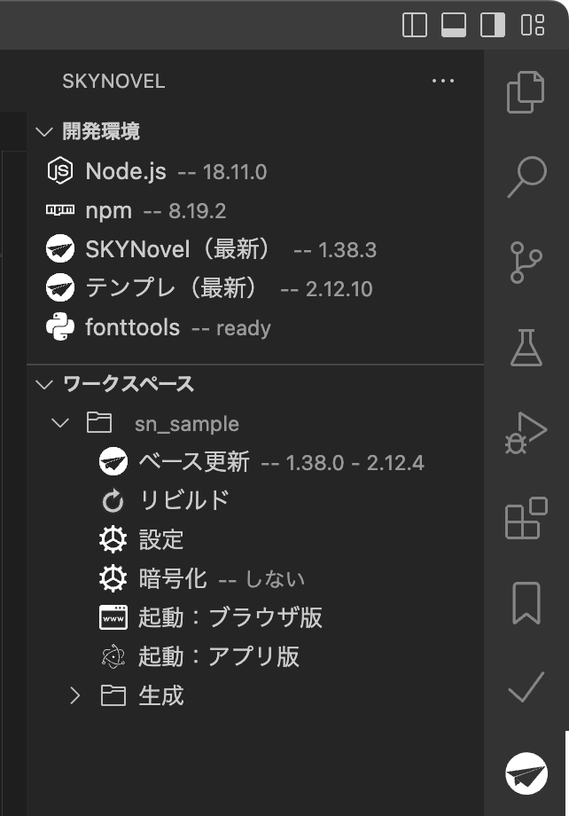

---
- Check for library and template updates
	- Pop-up announcement at the bottom right (if there is an update).
	- Various version display, automatic update with one [Base update] button.
	- Various functions such as "Launch browser version" can be performed with a single button.
- ライブラリやテンプレートの更新チェック
	- （更新があれば）右下にポップアップ告知
	- 各種バージョン表示、【ベース更新】ボタン一つで自動更新
	- 「ブラウザ版を起動」など、各種機能もボタン一つで

> 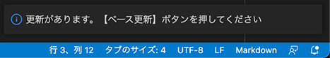

---
## Startup timing / 起動タイミング
- Documents in the language skynovel are now displayed.
	- 言語 skynovel のドキュメントが表示された
- doc/prj/prj.json exists in the opened folder.
	- 開いたフォルダに doc/prj/prj.json が存在する
- The development environment view is displayed.
	- 開発環境ビューが表示された

---
## Syntax Highlight / シンタックスハイライト
- Easy color coding of .sn script files.
	- .sn スクリプトファイルを見やすく色分け

> 

---
## Diagnostic function
> 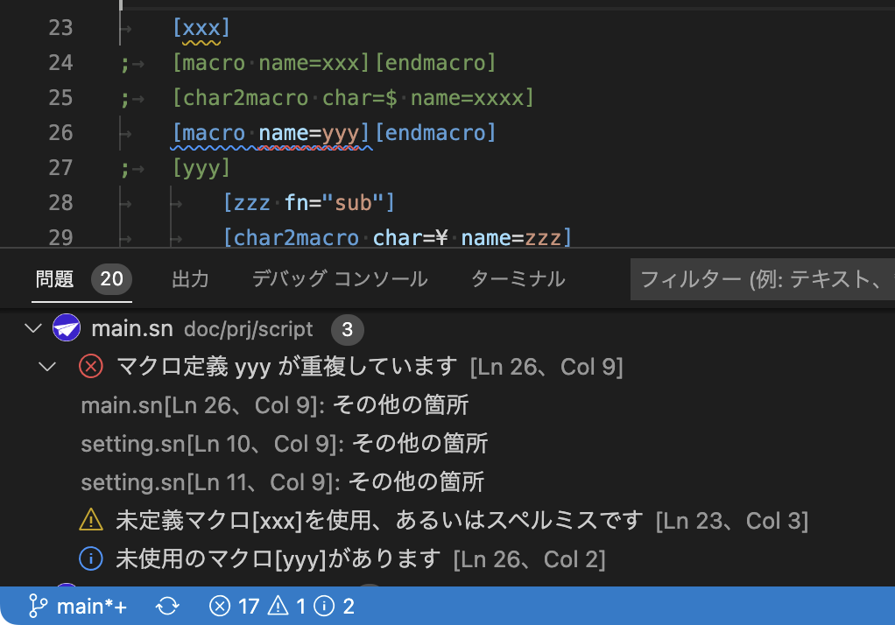

- error indication
	- Predefined tag and same name macro definition
	- Duplicate macro definitions in the same script/different scripts
	- Duplicate label names in the same script
	- When files with the same file name exist in separate folders
		- From the unique specifications of the novel game engine "Kirikiri". Specifications for searching files without specifying a storage folder
	- If the attribute type is as follows, an error is displayed if it does not exist in the project (however, variable values and string processing cannot be checked)
		- layer name
		- character layer name
		- image layer name
		- script file name
		- image file name
		- audio file name
		- HTML file name
		- difference name
		- frame name
		- character appearance production name
		- Text erase effect name
		- label name (for scripts)
	> 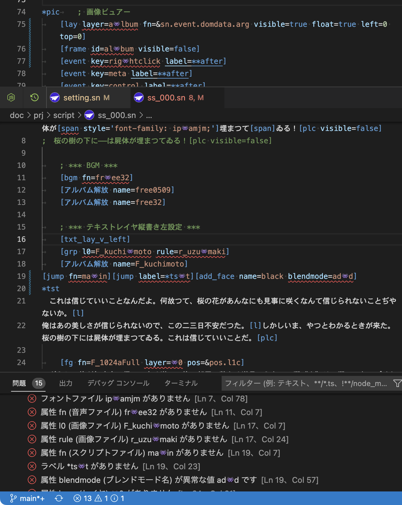
	- When the attribute type is [CSS style] and the file with the same name as the font name specified in [font-family] does not exist in the project
	- If the attribute type is one that does not exist in SKYNovel
		- event name
		- easing name
		- blend mode name
	- If the attribute value is duplicated in the next tag (duplicate declaration)
		- [macro name] ... macro definition (existing)
		- [add_face name] ... difference name
		- [add_lay layer] ... layer definition
		- [add_frame id] ... frame definition
		- [ch_in_style name] ... character appearance definition
		- [ch_out_style name] ... character erasure effect definition
		- [char2macro name] ... single character macro definition
	- warning display
		- When using an undefined macro
		- When the line break tag exceeds 64 lines (because there is a risk of forgetting to close the tag)
	- Information display
		- If there are unused macros
			- [macro] Suppress warnings by adding nowarn_unused=true when defining (macro that does not have to be used)
- Inlay tips
	- Enumerates script names to be called when a wildcard is specified for fn in [call]
	> 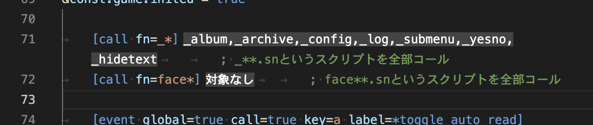

> Undefined macro and unused macro errors are often misspelled, and the error disappears on the spot when corrected.
	> 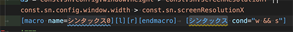
	> 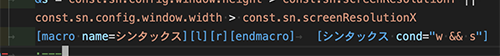

## 診断機能
> 

- エラー表示
	- 定義済みのタグと同名マクロ定義
	- 同一スクリプト・別スクリプトでのマクロ定義重複
	- 同一スクリプト内でのラベル名重複
	- 別々のフォルダに同じファイル名のファイルが存在する場合
		- ノベルゲームエンジン「吉里吉里」特有の仕様より。格納フォルダを指定しなくてよいファイル検索を行うための仕様
	- 属性の型が次の場合、プロジェクトに存在しない場合にエラー表示（ただし変数値や文字列加工はチェック不能）
		- レイヤ名
		- 文字レイヤ名
		- 画像レイヤ名
		- スクリプトファイル名
		- 画像ファイル名
		- 音声ファイル名
		- HTMLファイル名
		- 差分名称
		- フレーム名
		- 文字出現演出名
		- 文字消去演出名
		- ラベル名（スクリプトに対して）
	> 
	- 属性の型が【CSS style】の場合、【font-family】に指定されたフォント名と同名ファイルがプロジェクトに存在しない場合
	- 属性の型が次の場合、SKYNovelに存在しないものの場合
		- イベント名
		- イージング名
		- ブレンドモード名
	- 次のタグにおいて、属性値が重複していた場合（重複宣言）
		- [macro name]			... マクロ定義（既存）
		- [add_face name]		... 差分名称
		- [add_lay layer]		... レイヤ定義
		- [add_frame id]		... フレーム定義
		- [ch_in_style name]	... 文字出現演出定義
		- [ch_out_style name]	... 文字消去演出定義
		- [char2macro name]		... 一文字マクロ定義
- 警告表示
	- 未定義マクロを使用時
	- 改行タグが 64 行を超えた場合（タグ閉じ忘れの恐れが多いので）
- 情報表示
	- 未使用のマクロがある場合
		- [macro]定義時に nowarn_unused=true を追加すると、警告を抑制する（使われなくても構わないマクロ）
- インレイヒント
	- [call]で fnにワイルドカード指定した場合、コール対象のスクリプト名を列挙
	> 

> 未定義マクロや未使用マクロエラーはスペルミスの場合が多く、修正すればその場でエラーが消滅します。
	> 
	> 

---
## Coding assistance
- Hover
	- Definition information display (tags, macros)
		> 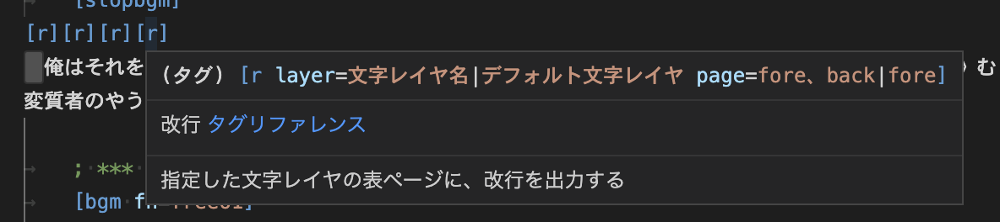
		> 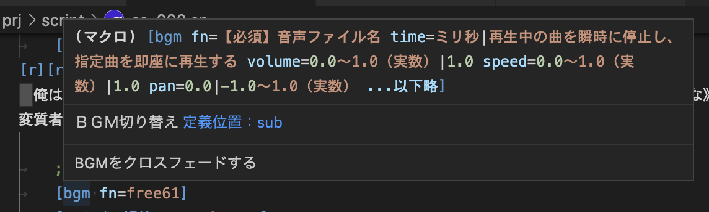
	- Display thumbnail image and vertical/horizontal size when attribute type is [image file name]
		> 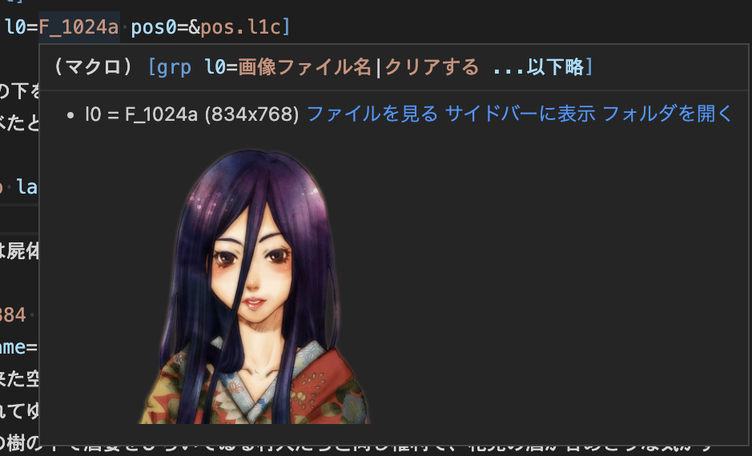
		- "View Files" link. Open image in VSCode
		- Show in Sidebar link. Display and select images in VSCode explorer
		- Open Folder link. Open a folder containing image files in your OS
- Auto completion
	- Tag name (Start by typing "[".)
	> 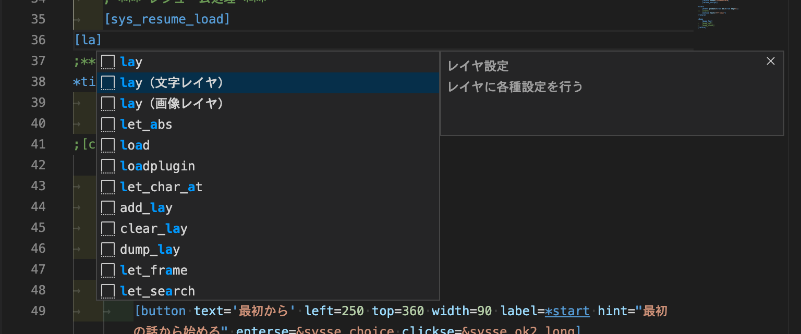
		- Some tags also show usage examples.
		> 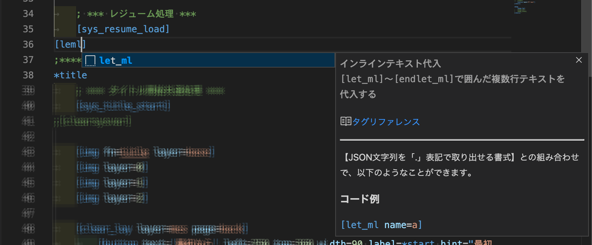
		> 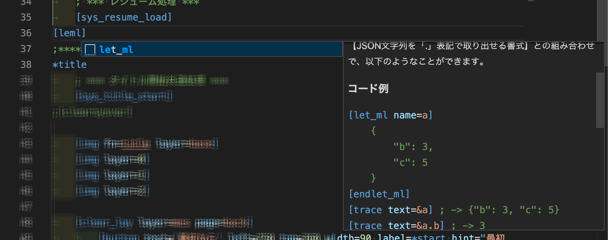
	- Attribute (With attribute description)
		- Enter " " in [] to start the program.
		> 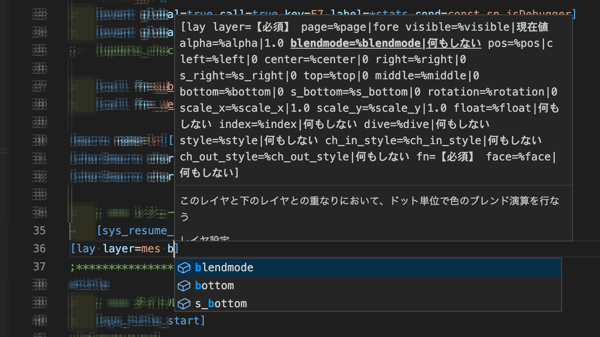
	- Attribute value (With attribute description)
		- Type "=" immediately after the attribute name in [] to start.
		> 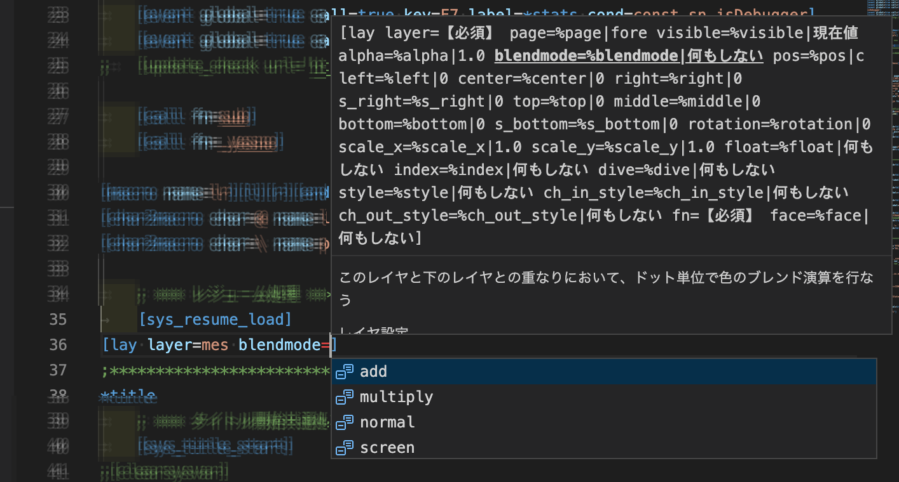
- Snippet completion
- Jump to definition / Show definition here (Tag, Macro, Plugin definition tag)
	- (Use F12 key to go back and forth between macro definition and macro usage)
	> 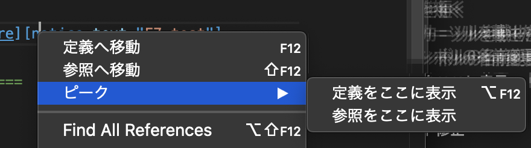
	> 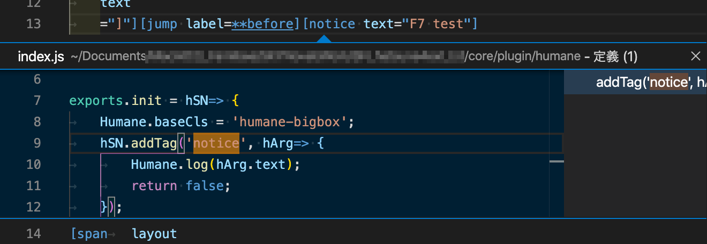
- Jump to reference / Show reference here (Tag, Macro, Plugin definition tag)
	> 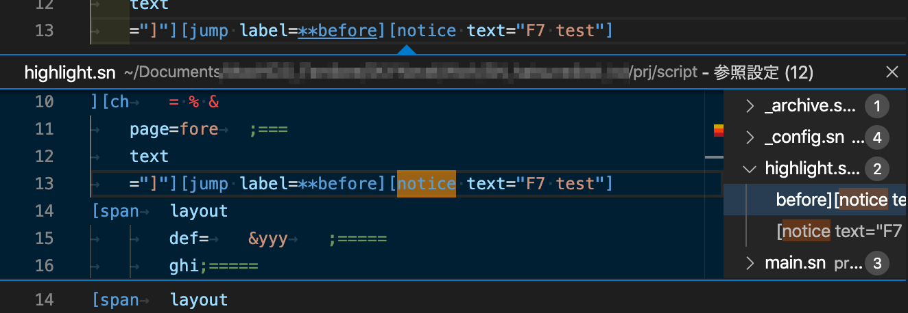
- Rename symbol (Macro name, Plugin definition tag)
	- (also activated by the F2 key)
	> 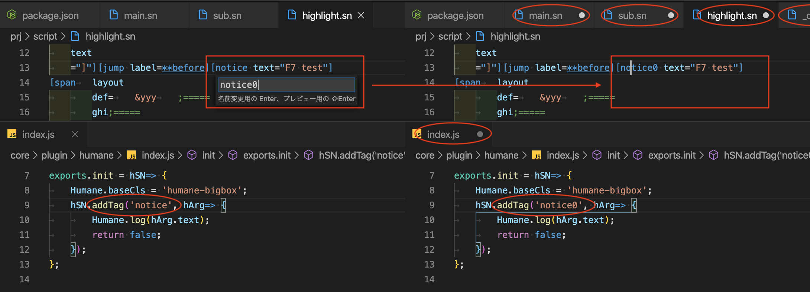

## コーディング補助
- ホバー
	- 定義情報表示（タグ、マクロ）
		> 
		> 
	- 属性の型が【画像ファイル名】の場合にサムネイル画像・縦横サイズを表示
		> 
		- [ファイルを見る]リンク。画像を VSCode で開く
		- [サイドバーに表示]リンク。画像を VSCode のエクスプローラーで表示・選択
		- [フォルダを開く]リンク。画像ファイルを含むフォルダを OS で開く
- コード補完
	- タグ名（「[」入力で起動）
	> 
		- 一部のタグには使用例なども示しています
		> 
		> 
	- 属性名（属性の説明つき）
		- []内で「 」（半角スペース）入力すると起動
		> 
	- 属性値名（属性の説明つき）
		- []内で属性名直後に「=」入力すると起動
		> 
- タグ入力時にスニペット挿入
- 「定義へ移動」「定義をここに表示」
	- （F12キーでマクロ定義とマクロ使用箇所を行ったり来たりできます）
	> 
	> 
- 「参照へ移動」「参照をここに表示」
	> 
- 「シンボルの名前変更」
	- （F2キーでも起動）
	> 

---
## Outline view and symbol search
### outline display
[View] - [Open View...] to display a list of symbols contained in the currently displayed file.
- Symbols are "labels, macro definitions, text, and partial tags (those involved in conditional branching and processing flow changes).
	- [jump]
	- [call]
	- [event]
	- [button]
	- [link]
	- [s]
	- [if]
	- [elsif]
	- [else]

 Select a symbol from the list and press the Enter key to go to that symbol.

 For example, the template would look something like this

- main .sn is prefixed by [event] system and [button] in the title.
	> 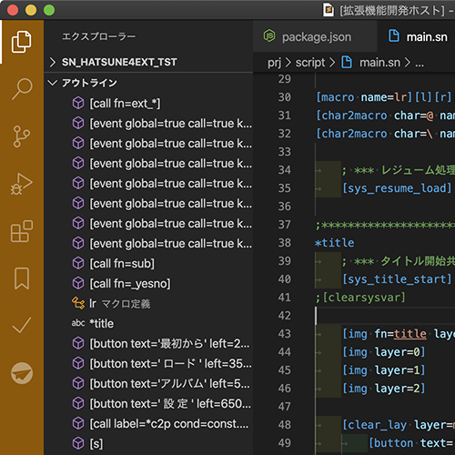

- sub .sn has a lot of macro definitions
	> 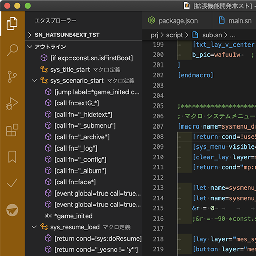

- The text is text-centric
	> 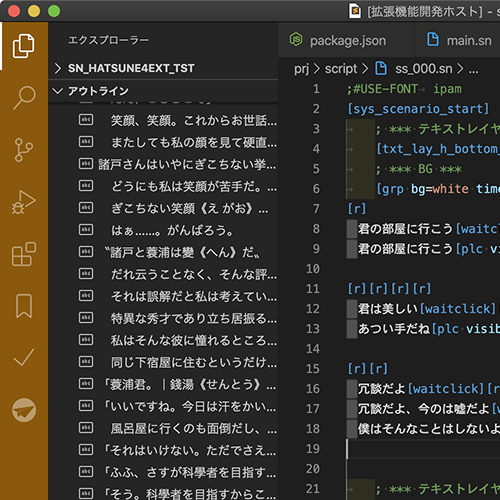

- Although it is not included in the template, even if [if]-type tags and text are complexly intertwined
	> 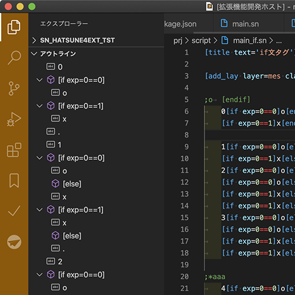

### Symbol Search
 Press the following keys to see a list of symbols in the file you are viewing.

|mac	|windows	|
--|--
|command + shift + o	|Ctrl + Shift + o	|
|Or command + p followed by @	|Or Ctrl + p followed by @	|

 If you continue typing ":", it will be sorted by category, such as label or macro definition.
 You can also select a symbol and press Enter to go to that symbol.
	> 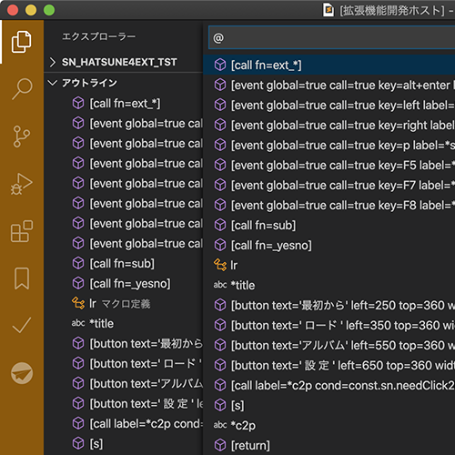

## アウトライン表示とシンボル検索
### アウトライン表示
【表示】-【ビューを開く...】から【アウトライン】を選ぶと、表示中のファイルに含まれるシンボル一覧が表示されます。
- シンボルとは「ラベル、マクロ定義、テキスト、一部タグ（条件分岐と処理の流れ変更に関わるもの）」のことです。
	- [jump]
	- [call]
	- [event]
	- [button]
	- [link]
	- [s]
	- [if]
	- [elsif]
	- [else]

　一覧からシンボルを選択し、Enterキーを押すとそのシンボルに移動します。

　例えばテンプレートでは以下のような表示になります。

- main .sn は最初の方に[event]系、タイトルの[button]がならぶ
	> 

- sub .sn はマクロ定義がずらり
	> 

- 本文だとテキスト中心
	> 

- テンプレートには含まれませんが、[if]系タグとテキストが複雑に絡み合っていてもこのとおり
	> 

### シンボル検索サポート
　以下のキーを押すと、表示しているファイル内のシンボルの一覧が表示されます。

|mac	|windows	|
--|--
|command + shift + o	|Ctrl + Shift + o	|
|もしくは command + p のち @	|もしくは Ctrl + p のち @	|

　続けて「:」をタイプすると、ラベルやマクロ定義等のカテゴリごとにソートされます。
　こちらもシンボルを選択し、Enterキーを押すとそのシンボルに移動します。
	> 

---
## Reference search palette / リファレンス検索パレット
	Open the API reference with the following steps
		コマンドパレットからリファレンスを参照できる
	The Reference search pallet to open API references
		次の手順でAPIリファレンスを開けます。

1. press Ctrl+Shift+P to open the command palette.
	1. Ctrl+Shift+Pを押してコマンドパレットを開きます。

> 

2. Execute the command "SKYNovel: Open reference search palette".
	2. SKYNovel: Open reference search palette」というコマンドを実行します。

> 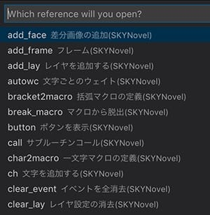

3. type the tag name you want to open the reference and press Enter to open the web manual.
	3. リファレンスを開きたいタグ名を入力し、EnterでWebのマニュアルを開きます。

> 

---
## Overview of Macros, Declaration of Types of Arguments
- In the [macro] definition, you can describe the outline of the macro, the explanation of the arguments, and the detailed explanation.

	With such a definition,
	> 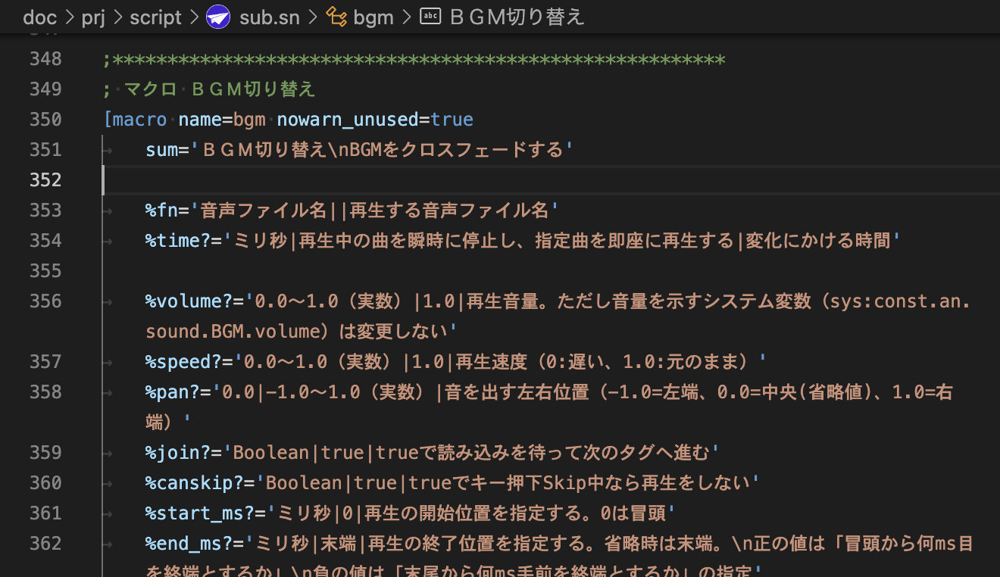

	Coding assistance such as hints can be received by hover etc.
	> 

- Available Coding Assistance (Excerpt)
	- Reference Search Palette ([Command Palette]-[Open Reference Search Palette])
	- Outline (displayed in [Outline View](https://dev.classmethod.jp/articles/vscode-new-side-panel/))
	- Mouse hover (hover mouse cursor over tag/macro name)
		- Too many attribute values ​​are inconvenient, so omit more than a certain number
	- Code completion function (input candidates displayed when entering [, = or single-byte spaces in scripts)
	- Argument description (hover displayed when [ or = or half-width space is entered in the script)

- format
	- sum attribute for macro summary description, detail attribute for macro detailed description
		- These can contain [\n] characters
			- In situations where only one line can be displayed, [\n] display up to the front
			- In hover tips that can display multiple lines, line breaks are displayed.

	- Others are descriptions of each attribute value. It is characterized by starting with [%]. Break down and explain the elements
		> Example) %no_voice_stop?='Boolean|false|true does not fade out the voice (sound effect of buffer name "voice") after page break'
	- [%]
		- Only in the [macro] tag, an attribute starting with "%" indicates a description of the attribute with the same name as the argument when using that macro
		- As you can see, it follows the variable name when defining the macro. (same as mp:~)
	- [no_voice_stop]
		- attribute name
			- [Digression] Since SKYNovel 1.36.0, kanji and hiragana can be used for attribute names
	- 【?】
		- ellipsis
		- Writing ? indicates that it is an [optional attribute].
		- Mandatory attributes without ?.
			- [Digression] Same meaning as "?", which means an optional property in TypeScript
	- [=]
	- [Boolean|false| If true~]
		- Attribute values ​​are other items. Values ​​are multiple items separated by |
		- [Boolean]
			+ 1 item: Range/Type
			+ An example is a "Boolean" that has a value of only true or false.
			+ [String] [Number] etc. Looking at the tag reference is helpful.
		- [false]
			+ Two items: Default value
			+ This item itself may be omitted, but use [||] notation
		- [If true]
			+ Three items: Overview

## マクロの概要説明と引数の型宣言
- [macro]定義で、マクロの概要や引数の説明や詳細説明を記述できる

	このような定義をすると、
	> 

	ホバーなどでヒントなどのコーディング補助が受けられる
	> 

- 受けられるコーディング補助（抜粋）
	- リファレンス検索パレット（【コマンドパレット】-【リファレンス検索パレットを開く】）
	- アウトライン（[アウトラインビュー](https://dev.classmethod.jp/articles/vscode-new-side-panel/)に表示）
	- マウスホバー（タグ・マクロ名あたりにマウスカーソルを重ねる）
		- 属性値が多すぎると逆に不便なため、一定数以上は省略する
	- コード補完機能（スクリプト中で [ や = や半角空白入力時に表示される入力候補）
	- 引数の説明（スクリプト中で [ や = や半角空白入力時に表示されるホバー）

- 書式
	- マクロ概要説明の sum 属性、マクロ詳細説明の detail 属性
		- これらは【\n】文字を入れる事ができる
			- 一行しか表示できない状況では【\n】手前までの表示
			- 複数行表示可能なホバーチップスなどでは、改行して表示する

	- その他は属性値それぞれの解説。【%】で始まるのが特徴。要素を分解して解説する
		> 例）%no_voice_stop?='Boolean|false|trueなら改ページ後、音声（バッファ名「音声」の効果音）をフェードアウトしない'
	- 【%】
		- [macro]タグでのみ、「%」で始まる属性は、そのマクロ使用時引数の同名属性解説を示す
		- その見た目通り、マクロ定義時の変数名に沿っている。（mp:〜 と同様）
	- 【no_voice_stop】
		- 属性名
			- 【余談】SKYNovel 1.36.0 以降は漢字や平仮名なども属性名に使用できる
	- 【?】
		- 省略記号
		- ? を書くと【省略可能な属性】であると示す。
		- ? を書かないと必須属性。
			- 【余談】TypeScriptの省略可能なプロパティを意味する「?」と同様の意味合い
	- 【=】
	- 【Boolean|false|trueなら〜】
		- 属性値はその他の項目。値は | で区切られた複数の項目になっている
		- 【Boolean】
			+ 一項目：値域・型
			+ 例は true か false のみの値を持つ「Boolean」が指定されている。
			+ 他に【String】【Number】など。タグリファレンスを眺めると参考になる。
		- 【false】
			+ 二項目：省略時の値
			+ この項目そのものも省略してもよいが、【||】表記にする
		- 【trueなら〜】
			+ 三項目：概要

---
## Debugger
- You can debug like a high-level programming language with VSCode, including step-in breakpoints.
	- (If you've never used a debugger in VSCode, the following documentation may be a bit helpful)
		[Debugging in Visual Studio Code](https://code.visualstudio.com/docs/editor/debugging#_debug-actions)
	- Currently, only unpackaged and debug-launched apps can be debugged.

- [Debugger Function Overview](#Debugger-Function-Overview)
	- [Automatically launch and connect the app and browser versions](#Automatically-launch-and-connect-the-app-and-browser-versions)
	- [About the Debug Button Bar](#About-the-Debug-Button-Bar)
	- [breakpoint stop](#breakpoint-stop)
		- [(A) line breakpoint](#(A)-line-breakpoint)
		- [(B) conditional breakpoint](#(B)-conditional-breakpoint)
		- [(C) hit-count breakpoint](#hit-(C)-count-breakpoint)
		- [(D) data breakpoint](#(D)-data-breakpoint)
		- [(E) function breakpoint](#(E)-function-breakpoint)
	- [Variable View](#Variable-View)
	- [Watching View](#Watching-View)
	- [call stack view](#call-stack-view)
	- [Debugging Console REPL](#Debugging-Console-REPL)
- [Hovering over a variable while stopped displays the value](#Hovering-over-a-variable-while-stopped-displays-the-value)
- [The ability to move back the breakpoint on a blank or comment-only line at the start of a debug](#The-ability-to-move-back-the-breakpoint-on-a-blank-or-comment-only-line-at-the-start-of-a-debug)

---
## デバッガー
- ステップイン・ブレークポイントなど、VSCode で高級プログラム言語のようなデバッグが可能です。
	- （VSCode でのデバッガーを使用したことがない方は、以下のドキュメントが少し参考になるかも）
		[Visual Studio Codeでデバッグする](https://webdesign.vdlz.xyz/Editor/VSCode/Doc/Editor/Doc005_Debugging.html)（内容はやや古いが邦訳）
	- 現在デバッグできるのは、非パッケージ化・デバッグ起動アプリのみです。

- [デバッガー機能概要](#デバッガー機能概要)
	- [アプリ・ブラウザ版の起動と接続を自動で](#アプリ・ブラウザ版の起動と接続を自動で)
	- [デバッグボタンバーについて](#デバッグボタンバーについて)
	- [ブレークポイント停止](#ブレークポイント停止)（通ったら、タグや&変数操作処理前にブレーク）
		- [(A) 行ブレークポイント](#(A)-行ブレークポイント)
		- [(B) 条件式ブレークポイント](#(B)-条件式ブレークポイント)（条件式が真なら、（略）処理前にブレーク）
		- [(C) ヒットカウントブレークポイント](#(C)-ヒットカウントブレークポイント)（ｎ回以上通ったら、（略）処理前にブレーク）
		- [(D) データブレークポイント](#(D)-データブレークポイント)（変数値が変化したときにブレーク）
		- [(E) 関数ブレークポイント](#(E)-関数ブレークポイント)（指定したタグやマクロが呼ばれる直前にブレーク）
	- [変数ビュー](#変数ビュー)（スクリプト実行位置の変数値を表示）
	- [ウォッチ式ビュー](#ウォッチ式ビュー)
	- [コールスタックビュー](#コールスタックビュー)
	- [デバッグコンソールREPL](#デバッグコンソールREPL)（Read-Eval-Print Loop）、ブレーク時に式を手入力して値を調べられる
- [停止中、変数にホバーすると値を表示](#停止中、変数にホバーすると値を表示)
- [デバッグ開始時、空白やコメントのみの行に指定されたブレークポイントを後ろにずらす機能](#デバッグ開始時、空白やコメントのみの行に指定されたブレークポイントを後ろにずらす機能)

---
## Debugger Function Overview

### Automatically launch and connect the app and browser versions

1. Click the pause symbol (vertical bar in a triangle) that appears when you place the mouse cursor over [Launch: App Version].

	> 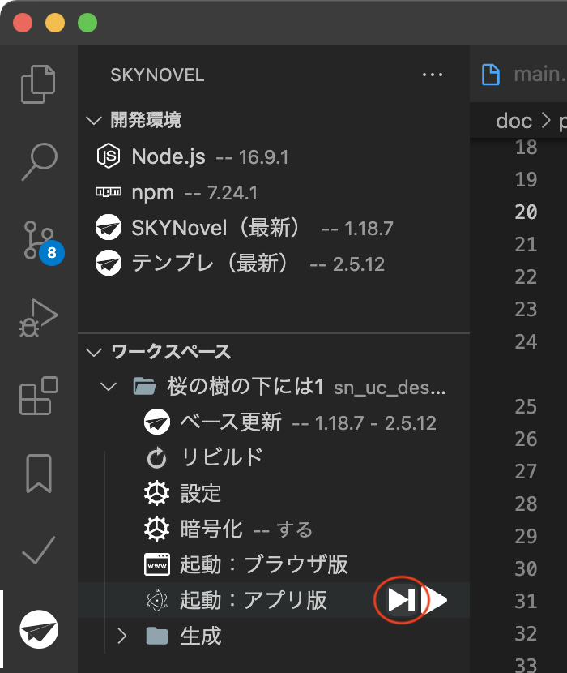

	(If you are using the browser version, click the pause symbol on the [Launch: Browser Version].

	> 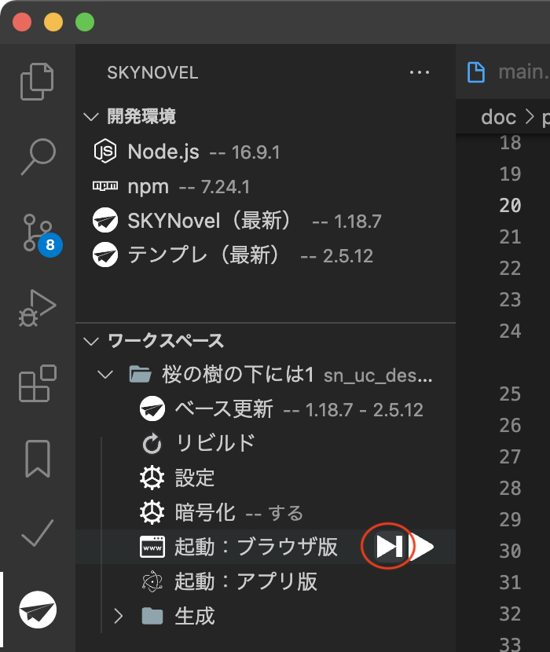

2. the application version starts and stops at the beginning of the script (main.sn, the first digit of the first line).

	A band cursor, pentagon stop mark, and debug button bar appear on the stop line.
The call stack view will also show [main.sn 1:1]

	> 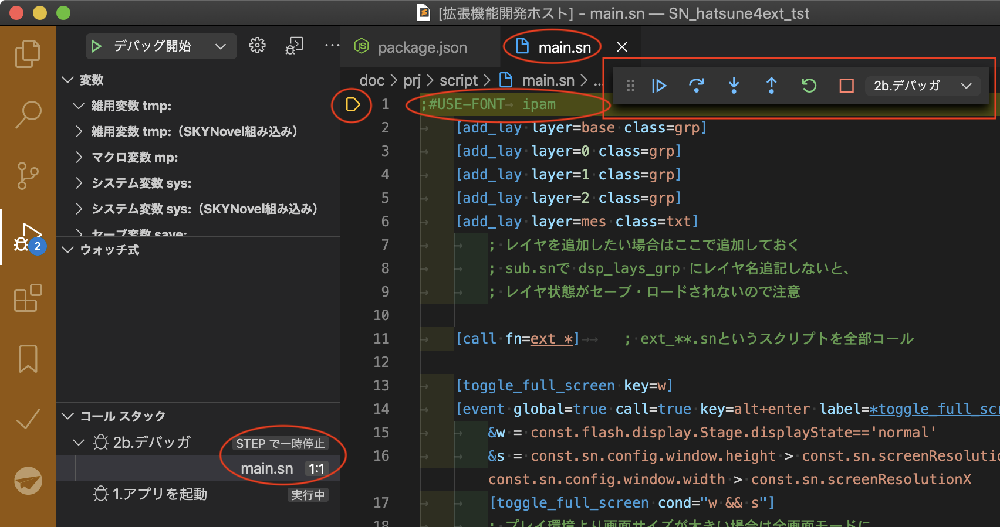

### About the Debug Button Bar
	You can run through the tags and & assignment grammars one step at a time, or you can skip to a break point (see below).
	You can even skip to the breakpoint (see below).

> 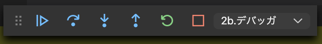

	1. Continue (F5 key)/Pause (F6 key)
		Continue ... Skip to breakpoint (waiting for events such as ka[l][p][s])
		Pause ... Pause (usually when waiting for an event)
	2. Step over (F10 key)
		If you're a macro, don't go inside, skip to the outside.
	3. Step-in (F11 key)
		If it's a macro, go inside. Otherwise, step over.
	4. Step out (Shift + F11)
		Skip from inside the macro until you get out. Otherwise, step over.
	5. restart button (Shift + Ctrl + F5 keys)
		Resume from the beginning of the game engine.
	6. stop (Shift + F5 key)
		Stop the debugger and the app, or quit debugging (stop each of the two)

### breakpoint stop
	Stops the break before processing tag and & variable operations. There are five types as follows.

### (A) line breakpoint
	If you click on the left side of the line number, the mark with a red circle will appear.
	The execution process of SKYNovel stops when it passes through there.

	It also appears in the breakpoint view.
	Breakpoints can be deleted, but you can also uncheck the checkbox to temporarily disable the breakpoint.

> 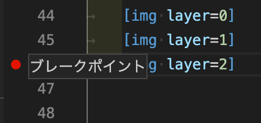

### (B) conditional breakpoint
	If the conditional expression is true, then (abbreviated) break before processing

1. right-click on the breakpoint and select

	> 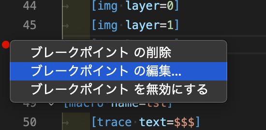

2. Selecting 【Expressions】 from 【Editing】 allows you to enter a conditional expression.

	When passing through, it only breaks if the conditional expression is true.

	> 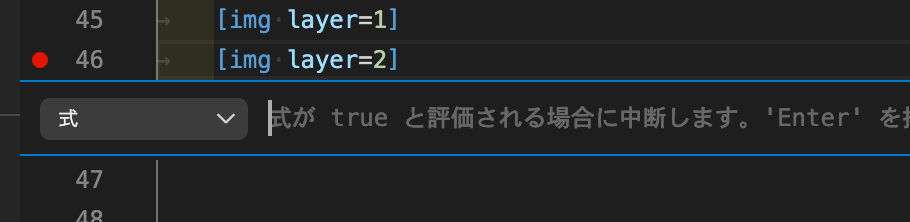

### (C) hit-count breakpoint
	If it passes more than n times, it breaks before processing.

1. if you select [Hit Count] from [Edit]

	> 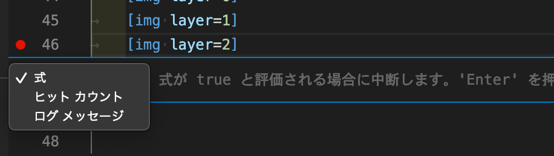

2. You can enter the hit count of "How many times do you want to break here?".

	> 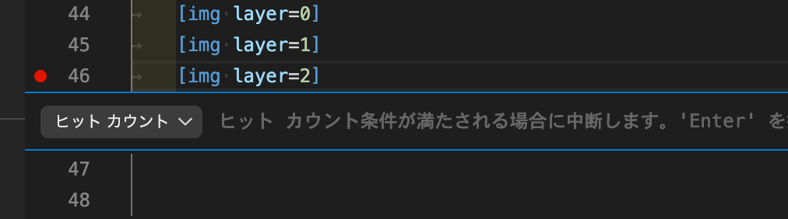

### (D) data breakpoint
	Break when the value of the variable is changed

	When you right-click on a variable in the Variable View and click on "Suspend when the value is changed," you can change the value of the variable by clicking on "Stop". Change Breakpoints] is added.
	(In the case of tmp variable, it is not displayed in the variable view because the variable does not exist unless something is assigned. (e.g. "I'll be back")

> 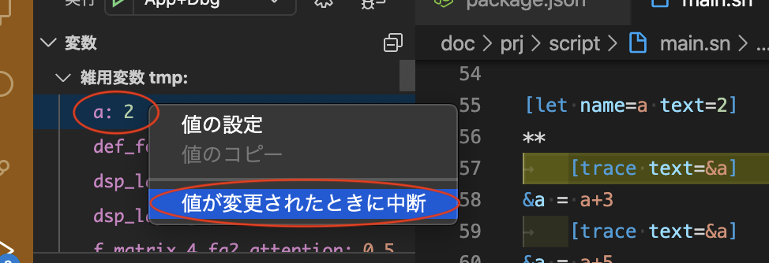

### (E) function breakpoint
	Break just before the specified tag or macro is called

1. If you press the "+" button in the breakpoint view and enter a tag or macro name, you will be able to see the following information

	> 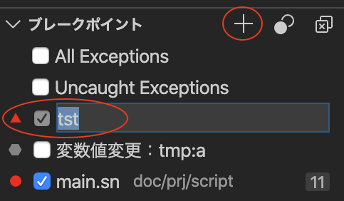

2. Break at all points just before it is called.

	> 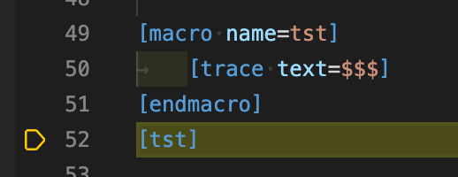

### Variable View
	Display variable values of the script execution position

1. You can check the contents of the variable.

	> 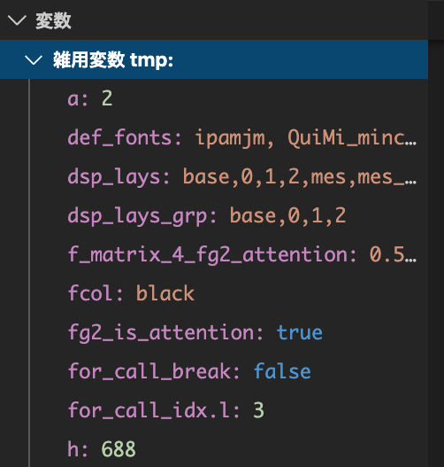

2. It is possible to change the value of a variable by inputting it manually while the program is stopped.
	- However, a variable name that begins with "const.〜" cannot be changed.
	- In addition, some variables whose variable names begin with "sn.˜" can be changed by SKYNovel. If you change it, it will be fixed at the input value.

		> 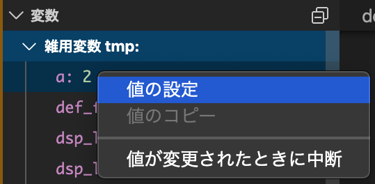
		> 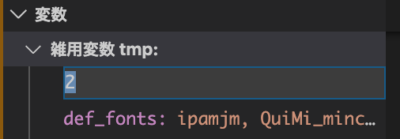

### Watching View
	If you register a variable or an expression, it will be displayed.
	If you register a variable or expression that you want to see how it changes, it will be highlighted whenever it changes.
	You can also register variables that do not (yet) exist. It will be displayed as 【null】.

> 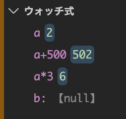

### call stack view
	Displays the break, step, etc. stop position.
	If it is in a macro, it shows the call hierarchy.

> 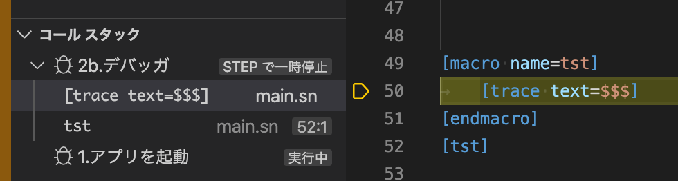

### Debugging Console REPL
	Read-Eval-Print Loop, which allows you to look up the value by manually entering an expression on a break.

> 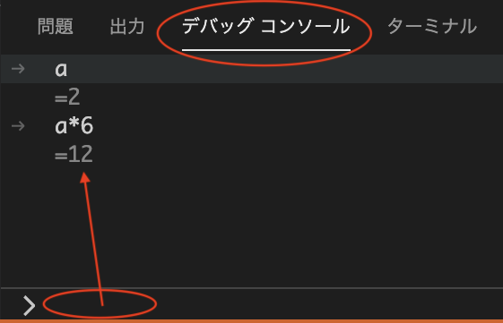

## Hovering over a variable while stopped displays the value
	Normal hovering in tag and macro definition display is temporarily disabled

> 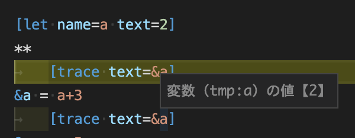

## The ability to move back the breakpoint on a blank or comment-only line at the start of a debug

> 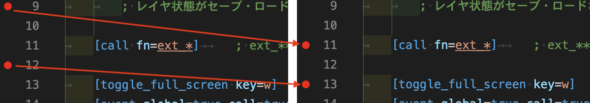

## デバッガー機能概要
### アプリ・ブラウザ版の起動と接続を自動で

1. 【起動：アプリ版】にマウスカーソルをのせると出てくる、一時停止マーク（三角に縦棒）をクリック

	> 

	（ブラウザ版なら【起動：ブラウザ版】の一時停止マークをクリック）

	> 

2. アプリ版が起動し、スクリプト冒頭（main.sn、1行目の1桁目）で停止します。

	停止行に帯カーソルと五角形の停止マーク、デバッグボタンバーが現われ、
	コールスタックビューにも【main.sn 1:1】と表示されます。

	> 

### デバッグボタンバーについて
	タグや&代入文法を１ステップとして、一つずつ実行したり出来ます。
	ブレークポイント（後述）までスキップすることもできます。

> 

	1. 続行（F5 キー） / 一時停止（F6 キー）
		続行 ... ブレークポイント（か[l][p][s]などイベント待ち）までスキップ
		一時停止 ... 一時停止する（ふつうイベント待ちで押せるようになる）
	2. ステップオーバー（F10 キー）
		マクロなら中へ入らず、外に出たところまでスキップ
	3. ステップイン（F11 キー）
		マクロなら中へ入る。それ以外はステップオーバー
	4. ステップアウト（Shift + F11 キー）
		マクロ内から外に出るまで飛ばす。それ以外はステップオーバー
	5. 再起動ボタン（Shift + Ctrl + F5 キー）
		ゲームエンジン冒頭から再開する
	6. 停止（Shift + F5 キー）
		デバッガーやアプリを停止、デバッグ終了（２つそれぞれを停止して下さい）

### ブレークポイント停止
	タグや&変数操作処理前にブレーク停止する機能。次の五種類があります。

### (A) 行ブレークポイント
	行番号の左をクリックすると赤丸マークの目印が付きます。
	SKYNovelの実行処理がそこを通ると停止します。

	ブレークポイントビューにも表示されます。
	ブレークポイントは削除もできますが、チェックボックスを外すと一時的にブレークしないようにできます。

> 

### (B) 条件式ブレークポイント
	条件式が真なら、（略）処理前にブレーク

1. ブレークポイントを右クリックし、

	> 

2. 【編集】から【式】を選択すると、条件式を入力できます。

	ここを通る際、条件式が真である場合のみブレークします。

	> 

### (C) ヒットカウントブレークポイント
	ｎ回以上通ったら、（略）処理前にブレーク

1. 【編集】から【ヒットカウント】を選択すると、

	> 

2. 「ここを何回目に通ったときにブレークするか」のヒットカウント回数を入力できます。

	> 

### (D) データブレークポイント
	変数値が変化したときにブレーク

	変数ビューの変数を右クリックし、【値が変更されたときに中断】をクリックすると、【変数値変更ブレークポイント】が追加されます。
	（tmp変数の場合はなにか代入しないと変数が存在しないため、変数ビューに表示されません）

> 

### (E) 関数ブレークポイント
	指定したタグやマクロが呼ばれる直前にブレーク

1. ブレークポイントビューで「＋」ボタンを押し、タグやマクロ名を入力すると、

	> 

2. それが呼び出される直前、すべての箇所でブレークします。

	> 

### 変数ビュー
	スクリプト実行位置の変数値を表示

1. 変数の内容を確認できます。

	> 

2. 【値の設定】停止中、手入力で変数値変更が可能です。
	- ただし変数名が「const.〜」で始まる変数は変更不可です。
	- また変数名が「sn.〜」で始まる変数は SKYNovelが変化させるものがあり、それを変更すると入力値で固定されてしまいます。

		> 
		> 

### ウォッチ式ビュー
	変数や式を登録しておくと、表示されます。
	様子を見たい変数や式を登録しておくと、変化するたびに強調表示されます。
	（まだ）存在しない変数も登録しておけます。（【null】と表示されます）

> 

### コールスタックビュー
	ブレークやステップなどの停止位置を表示します。
	マクロ内なら呼び出し階層を表示します。

> 

### デバッグコンソールREPL
	（Read-Eval-Print Loop）、ブレーク時に式を手入力して値を調べられる

> 

### 停止中、変数にホバーすると値を表示
	タグやマクロ定義表示の通常ホバーは一時無効になる

> 

### デバッグ開始時、空白やコメントのみの行に指定されたブレークポイントを後ろにずらす機能

> 

---
## shortcut key / ショートカットキー
- normal condition / 通常状態

	| Key	| Func	| 機能	|
	| - | - | - |
	| F2	| rename the macro	| マクロ名変更	|
	| F5	| Activate debug function	| デバッグ機能起動	|
	| F9	| Switching Breakpoints	| ブレークポイントの切り替え	|
	| F12	| 定義へ移動、定義をここに表示	| Go to definitions, and view definitions here	|

- Debugger running / デバッガー実行中

	| Key	| Func	| 機能	|
	| - | - | - |
	| F5	| Continue	| 続行	|
	| F6	| Pause	| 一時停止 |
	| F10	| Step over	| ステップオーバー |
	| F11	| Step-in	| ステップイン |
	| Shift + F11	| Step out	| ステップアウト |
	| Shift + Ctrl + F5	| restart button	| 再起動ボタン |
	| Shift + F5	| stop	| 停止 |

---
## Font size optimization / フォントサイズ最適化
### (font size) Minimize the necessary / （フォントサイズを）必要最小限にする
- [設定]画面-[パッケージ]の【必要最小限にする】
	- 有効にすると、最低限の文字グリフを含んだフォントファイルを生成・差し替える
	- 無効にすると、フルサイズのフォントファイルをコピーする
	- フォント情報、一覧や削減サイズなどを表示

> 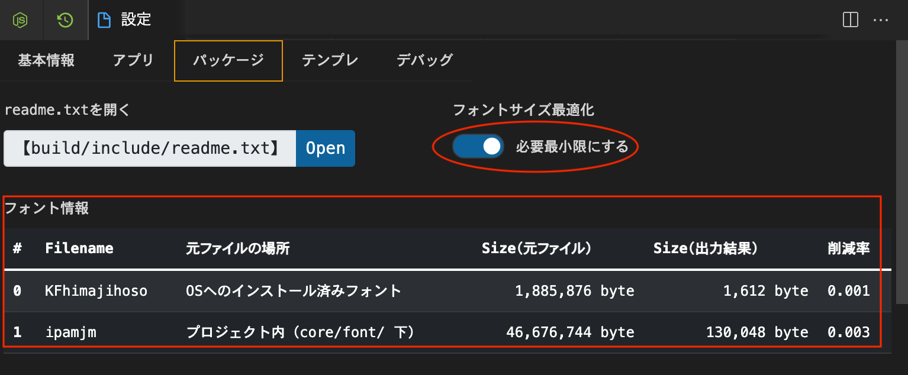

### Automatic copying of font files / フォントファイルを自動コピー
- フォントは以下の場所からサーチしてプロジェクト（doc/prj/script/ 下）にコピーする
	- プロジェクト内（core/font/ 下）に開発者が自発的に置いたファイル
	- OS（ユーザー別）へのインストール済みフォント
	- OS（ユーザー共通）へのインストール済みフォント
		- 設定画面にもエラー表示

> 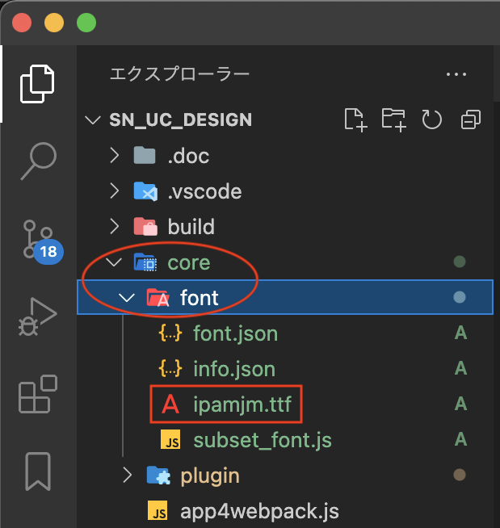

### Specify and use fonts in your project / プロジェクトでフォントを指定し、使用する
- プロジェクトでフォント名を指定する。以下のパターンがある
	- [設定]画面：[テンプレ]-[デフォルトフォント] でデフォルトとなるフォント名
		- 実体は doc/prj/*/setting.sn の変数 def_fonts
		- カンマ区切りで複数指定できる（このへんは CSS 同様）

> 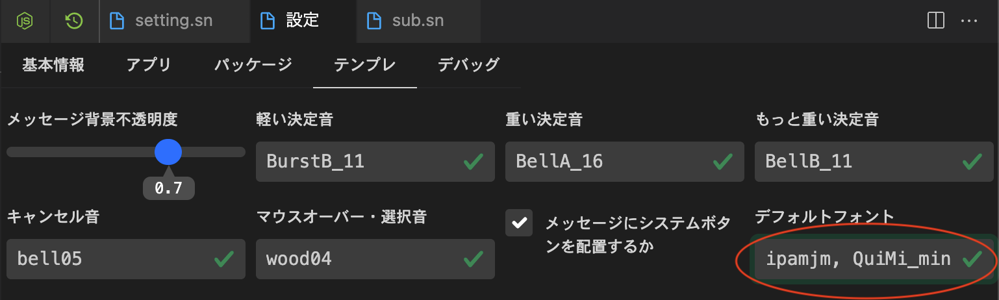

		- 存在しないフォント名の場合はエラー

> 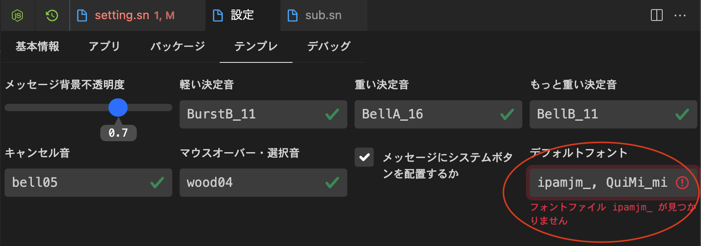
> 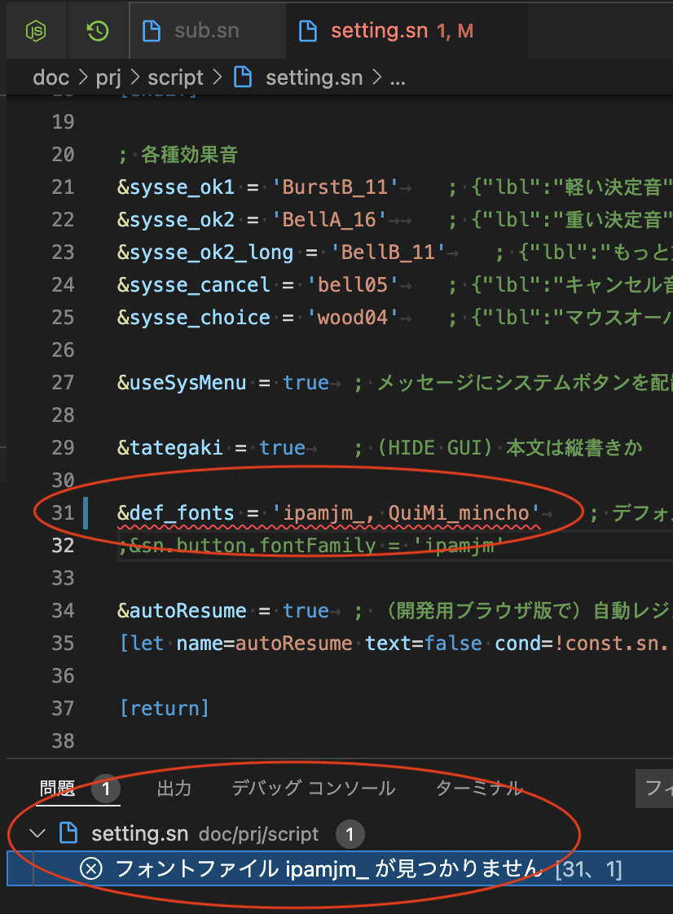

		- スクリプト：[span] タグの style属性で font-family 指定したフォント名
			- 例）[span style='font-family: KFhimajihoso; color: skyblue;']
		- スクリプト：[span] タグの style属性で font-family を指定しないと、デフォルトフォントを指定したものとする（簡単にデフォルトフォントに戻す手段）
			- 例）[span]

> 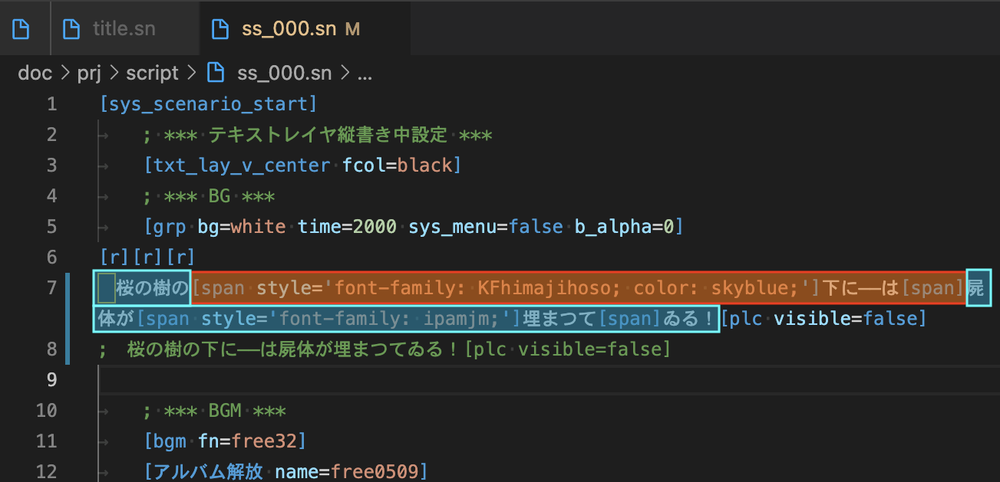

		- 本文でフォントが適用され表示されます。
			- 以下の例では【下に──は（赤領域の文字）】が「ＫＦひま字細」フォント、
			- それ以外の文字は「IPAex明朝」フォントとなる

> 

---
## Automatic icon creation / アイコン自動作成
- Just prepare "build/icon.png" and it will automatically generate ".ico" file for Windows and ".icns" file for macOS.
	- 「build/icon.png」を準備するだけで、Windows 用の「.ico」ファイル、macOS 用の「.icns」ファイルを自動生成します。
> 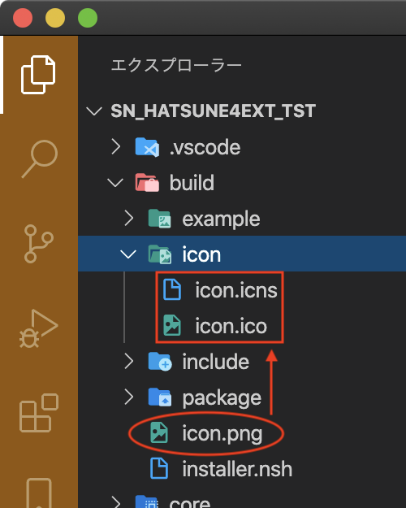

---
- Automatically Update prj/path.json
- ファイル増減を監視して prj/path.json に自動更新

---
- Automatically Create SpriteSheet's json from images
	+ ex) breakline.5x20.png -> breakline.json
	+ It is meaningless and OK. Because it is internal processing.
- スプライトシート用json自動生成機能
	+ ex) breakline.5x20.png というファイル名の画像から breakline.json を作成
	+ 意味不明でOK、内部的な処理なので

　スプライトシートは、生成された json を指定することで画像/動画と同じように使用できます。

---
- Automatically Update core/plugin.js
	+ It is meaningless and OK. Because it is internal processing.
- プラグインフォルダ増減でビルドフレームワークに反映する機能
	+ 意味不明でOK、内部的な処理なので

---
## License ... [MIT](LICENSE)
- Font Awesome -- [Font Awesome Free License](https://fontawesome.com/license/free) ([CC BY 4.0](https://creativecommons.org/licenses/by/4.0/deed.ja))
- Other libraries -- About [MIT](https://opensource.org/licenses/mit-license.php).

---
## Famibee is ?
- [WebSite : 電子演劇部](https://famibee.blog.fc2.com/)
- [Github](https://github.com/famibee/SKYNovel)
- [npm](https://www.npmjs.com/package/skynovel)
- Twitter ([famibee](https://twitter.com/famibee))
