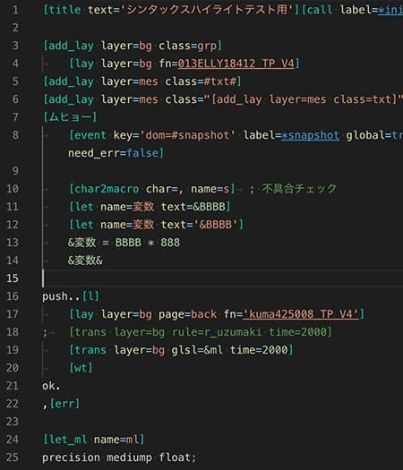
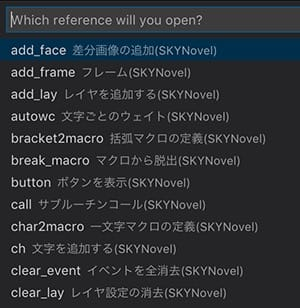

# SKYNovel Extension for VSCode

[CHANGELOG.md](CHANGELOG.md)

---

## Features (Load when *.sn is displayed)
- Syntax Highlight
- The Reference search pallet to open API references
- Automatically Create SpriteSheet's json from images
	+ ex) breakline.5x20.png -> breakline.json
- Automatically Update prj/path.json
	+ It is meaningless and OK. Because it is internal processing.
- Automatically Update core/plugin/plugin.js
	+ It is meaningless and OK. Because it is internal processing.

## 機能（*.snファイルを表示したときにロードします）
- シンタックスハイライト（.sn スクリプトファイルを見やすく色分け）
- リファレンス検索パレットでAPIリファレンス

- スプライトシート用json自動生成機能
	+ ex) breakline.5x20.png というファイル名の画像から breakline.json を作成
- ファイル増減を監視しして prj/path.json に自動更新
	+ 意味不明でOK、内部的な処理なので

- プラグインフォルダ増減でビルドフレームワークに反映する機能
	+ 意味不明でOK、内部的な処理なので

# Syntax Highlight / シンタックスハイライト

# Reference search palette
You can open API references with your browser by following the steps
1. Push Ctrl+Shift+P to open the Command Pallet.
3. Execute the command "SKYNovel: Open reference search palette".
3. Input tag name to open the reference.

# リファレンス検索パレット
　次の手順でAPIリファレンスを開けます。
1. Ctrl+Shift+Pを押してコマンドパレットを開きます。

2. SKYNovel: Open reference search palette」というコマンドを実行します。

3. リファレンスを開きたいタグ名を入力し、Enterで開きます。

---
## License ... [MIT](LICENSE)

---
## Famibee is ?
- [WebSite : 電子演劇部](https://famibee.blog.fc2.com/)
- [Github](https://github.com/famibee/SKYNovel)
- [npm](https://www.npmjs.com/package/skynovel)
- Twitter ([famibee](https://twitter.com/famibee))
