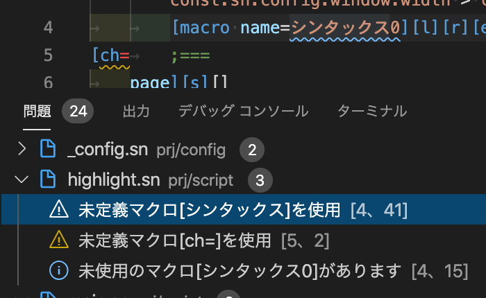
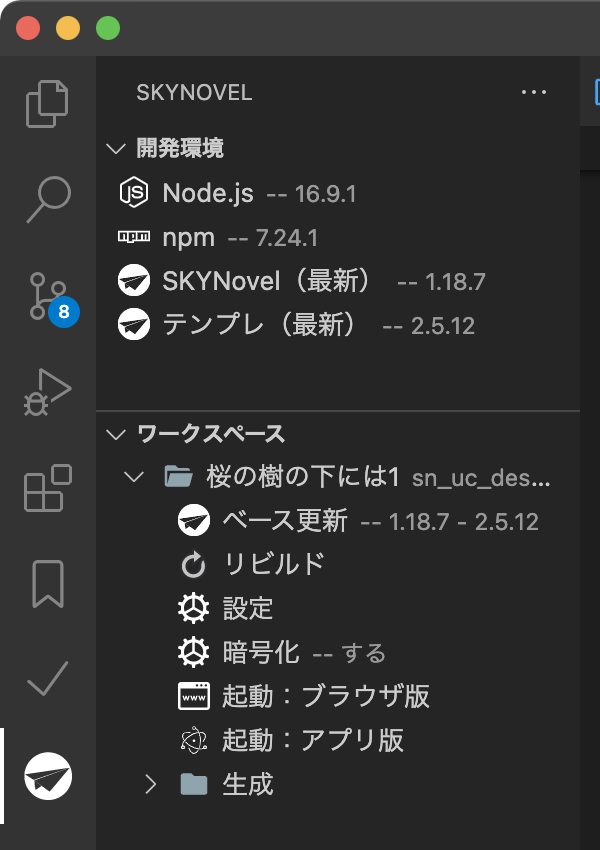

# SKYNovel Extension for VSCode

[SKYNovel - Visual Studio Marketplace](https://marketplace.visualstudio.com/items?itemName=famibee.skynovel)

[CHANGELOG.md](CHANGELOG.md)

---
## After installing this extension ... / この拡張機能をインストールしたら……。
 Next, let's download and unzip the sample project, and open the folder with VSCode!

　次はサンプルプロジェクトをダウンロード・解凍し、VSCodeで【フォルダを開く】してみましょう！
- [Novelgame(Yoko-gaki) sample project「初音館にて」](https://github.com/famibee/SKYNovel_hatsune)
- [Novelgame(Tate-gaki) sample project「桜の樹の下には」](https://github.com/famibee/SKYNovel_uc)
- [simple sample project](https://github.com/famibee/SKYNovel_sample)

# List of Functions / 機能一覧
- [Startup timing / 起動タイミング](#Startup-timing--起動タイミング)
- [Syntax Highlight / シンタックスハイライト](#Syntax-Highlight--シンタックスハイライト)
- [Diagnostic function](#Diagnostic-function) / [診断機能](#診断機能)
- [Coding assistance](#Coding-assistance) / [コーディング補助](#コーディング補助)
- [Activity Bar / アクティビティバー](#Activity-Bar--アクティビティバー)
- [Reference search palette / リファレンス検索パレット](#Reference-search-palette--リファレンス検索パレット)

---
## Startup timing / 起動タイミング
- When prj/prj.json and package.json exists in "Open folder".
	- 「フォルダを開く」で prj/prj.json と package.json が存在するとき
- If the above conditions are met, the development function can be used as a SKYNovel project
	- 上記条件を満たせば、SKYNovelプロジェクトとして開発機能が使用できます
- When you open the .sn file. (Enable syntax highlighting only)
	- *.snファイルを開いたとき（シンタックスハイライトのみ有効に）

---
## Syntax Highlight / シンタックスハイライト
- Easy color coding of .sn script files.
	- .sn スクリプトファイルを見やすく色分け

---
## Diagnostic function

- Displays an error when there are files with the same file name in different folders.
- Error message on macro definition with predefined tag and same name.
- Error display for duplicate label names in the same script.
- Error display for macro definition duplication in multiple files.
- Warning when using undefined macros.
- Report unused macro definitions.

	
	
	- After the macro is defined, the macro will not be reported even if it is not used, if [;#NO_WARM_UNUSED_MACRO (macro name)] is specified.
- Warning if line break tag exceeds 10 lines. (There's a lot of risk of forgetting to close the tag.)

## 診断機能
- 別々のフォルダに同じファイル名のファイルが存在する場合にエラー表示
- 定義済みのタグと同名マクロ定義にエラー表示
- 同一スクリプト内でのラベル名重複にエラー表示
- 複数ファイルでのマクロ定義重複にエラー表示
- 未定義マクロを使用時に警告
- 未使用のマクロ定義を報告

	
	
	- マクロ定義後に【;#NO_WARM_UNUSED_MACRO （マクロ名）】という記述をすると、そのマクロは未使用でも報告しなくなります。
- 改行タグが10行を超えたら警告（タグ閉じ忘れの恐れが多いので）

---
## Coding assistance
- Hover information (Tag, Macro)
	
	
- Auto completion
	- Tag name (Start by typing "[".)
	
		- Some tags also show usage examples.
		
		
	- Attribute (With attribute description)
		- Enter " " in [] to start the program.
		
	- Attribute value (With attribute description)
		- Type "=" immediately after the attribute name in [] to start.
		
- Snippet completion
- Jump to definition / Show definition here (Tag, Macro, Plugin definition tag)
	
	
- Jump to reference / Show reference here (Tag, Macro, Plugin definition tag)
	
- Rename symbol (Macro name, Plugin definition tag)
	

## コーディング補助
- ホバーで情報表示（タグ、マクロ）
	
	
- コード補完
	- タグ名（「[」入力で起動）
	
		- 一部のタグには使用例なども示しています
		
		
	- 属性名（属性の説明つき）
		- []内で「 」（半角スペース）入力すると起動
		
	- 属性値名（属性の説明つき）
		- []内で属性名直後に「=」入力すると起動
		
- タグ入力時にスニペット挿入
- 「定義へ移動」「定義をここに表示」
	
	
- 「参照へ移動」「参照をここに表示」
	
- 「シンボルの名前変更」
	

---
## Activity Bar / アクティビティバー
- Add Activity Bar to provide various information and useful functions.
	- Activity Barを追加し、各種情報や便利機能を提供します。

	

---
- Library update check
	- Pop-up announcement at the bottom right (if there is an update).
	- Display in Activity Bar, update with one button.
	- Various functions such as "Launch browser version" can be performed with a single button.
- ライブラリ更新チェック
	- （更新があれば）右下にポップアップ告知
	- Activity Barにも表示、ボタン一つで更新
	- 「ブラウザ版を起動」など、各種機能もボタン一つで

---
## Reference search palette / リファレンス検索パレット
	Open the API reference with the following steps
		コマンドパレットからリファレンスを参照できる
	The Reference search pallet to open API references
		次の手順でAPIリファレンスを開けます。

1. press Ctrl+Shift+P to open the command palette.
	1. Ctrl+Shift+Pを押してコマンドパレットを開きます。

2. Execute the command "SKYNovel: Open reference search palette".
	2. SKYNovel: Open reference search palette」というコマンドを実行します。

3. type the tag name you want to open the reference and press Enter to open the web manual.
	3. リファレンスを開きたいタグ名を入力し、EnterでWebのマニュアルを開きます。

---
- Automatically Update prj/path.json
- ファイル増減を監視して prj/path.json に自動更新

---
- Automatically Create SpriteSheet's json from images
	+ ex) breakline.5x20.png -> breakline.json
	+ It is meaningless and OK. Because it is internal processing.
- スプライトシート用json自動生成機能
	+ ex) breakline.5x20.png というファイル名の画像から breakline.json を作成
	+ 意味不明でOK、内部的な処理なので

　スプライトシートは、生成された json を指定することで画像/動画と同じように使用できます。

---
- Automatically Update core/plugin.js
	+ It is meaningless and OK. Because it is internal processing.
- プラグインフォルダ増減でビルドフレームワークに反映する機能
	+ 意味不明でOK、内部的な処理なので

---
## License ... [MIT](LICENSE)

---
## Famibee is ?
- [WebSite : 電子演劇部](https://famibee.blog.fc2.com/)
- [Github](https://github.com/famibee/SKYNovel)
- [npm](https://www.npmjs.com/package/skynovel)
- Twitter ([famibee](https://twitter.com/famibee))
