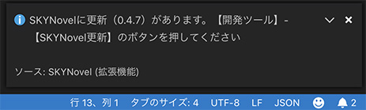

# SKYNovel Extension for VSCode

[SKYNovel - Visual Studio Marketplace](https://marketplace.visualstudio.com/items?itemName=famibee.skynovel)

[CHANGELOG.md](CHANGELOG.md)

---
## After installing this extension ... / この拡張機能をインストールしたら……。
 Next, let's download and unzip the sample project, and open the folder with VSCode!

　次はサンプルプロジェクトをダウンロード・解凍し、VSCodeで【フォルダを開く】してみましょう！
- [Novelgame(Yoko-gaki) sample project「初音館にて」](https://github.com/famibee/SKYNovel_hatsune)
- [Novelgame(Tate-gaki) sample project「桜の樹の下には」](https://github.com/famibee/SKYNovel_uc)
- [simple sample project](https://github.com/famibee/SKYNovel_sample)

---

## Features
- Startup timing:
	- When prj / prj.json exists in "Open folder".
	- When you open the .sn file.
- Add Activity Bar to provide various information and useful functions.
- Syntax Highlight
- Library update check
- The Reference search pallet to open API references
- Automatically Update prj/path.json
- Automatically Create SpriteSheet's json from images
	+ ex) breakline.5x20.png -> breakline.json
	+ It is meaningless and OK. Because it is internal processing.
- Automatically Update core/plugin/plugin.js
	+ It is meaningless and OK. Because it is internal processing.

## 機能
# 起動タイミング
- 「フォルダを開く」で prj/prj.json が存在するとき
- *.snファイルを開いたとき

# Activity Bar / アクティビティバー
- Activity Barを追加し、各種情報や便利機能を提供します。

	

- ライブラリ更新チェック
	- 右下にポップアップ告知
	- Activity Barにも表示、ボタン一つで更新
	- 「ブラウザ版を起動」など、各種機能もボタン一つで

	

- ファイル増減を監視しして prj/path.json に自動更新
- スプライトシート用json自動生成機能
	+ ex) breakline.5x20.png というファイル名の画像から breakline.json を作成
	+ 意味不明でOK、内部的な処理なので

　スプライトシートは、生成された json を指定することで画像/動画と同じように使用できます。

- プラグインフォルダ増減でビルドフレームワークに反映する機能
	+ 意味不明でOK、内部的な処理なので

# Syntax Highlight / シンタックスハイライト
- シンタックスハイライト（.sn スクリプトファイルを見やすく色分け）

# Reference search palette
You can open API references with your browser by following the steps
1. Push Ctrl+Shift+P to open the Command Pallet.
3. Execute the command "SKYNovel: Open reference search palette".
3. Input tag name to open the reference.

# リファレンス検索パレット
　次の手順でAPIリファレンスを開けます。
1. Ctrl+Shift+Pを押してコマンドパレットを開きます。

2. SKYNovel: Open reference search palette」というコマンドを実行します。

3. リファレンスを開きたいタグ名を入力し、EnterでWebのマニュアルを開きます。

---
## License ... [MIT](LICENSE)

---
## Famibee is ?
- [WebSite : 電子演劇部](https://famibee.blog.fc2.com/)
- [Github](https://github.com/famibee/SKYNovel)
- [npm](https://www.npmjs.com/package/skynovel)
- Twitter ([famibee](https://twitter.com/famibee))
